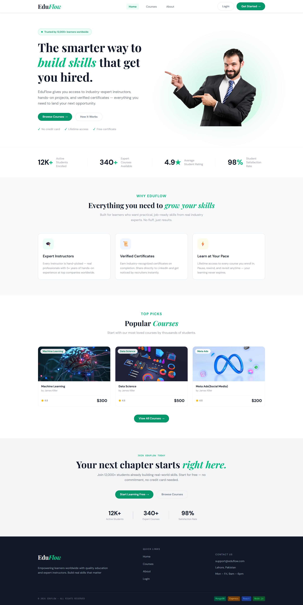
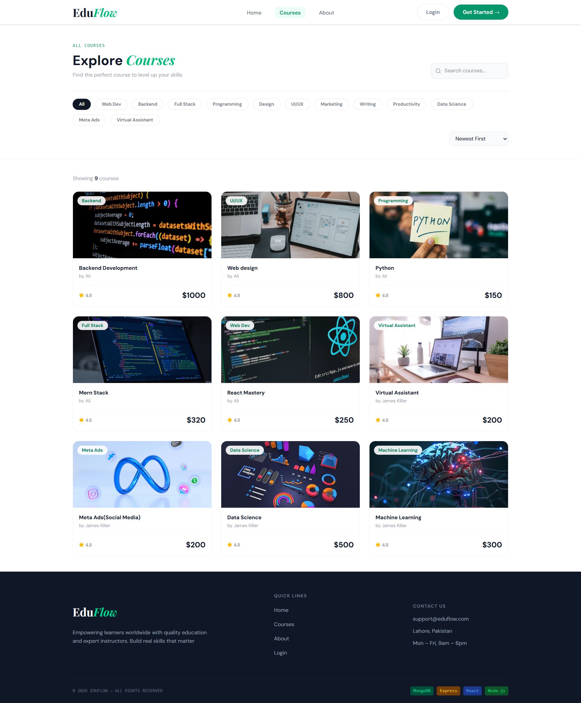
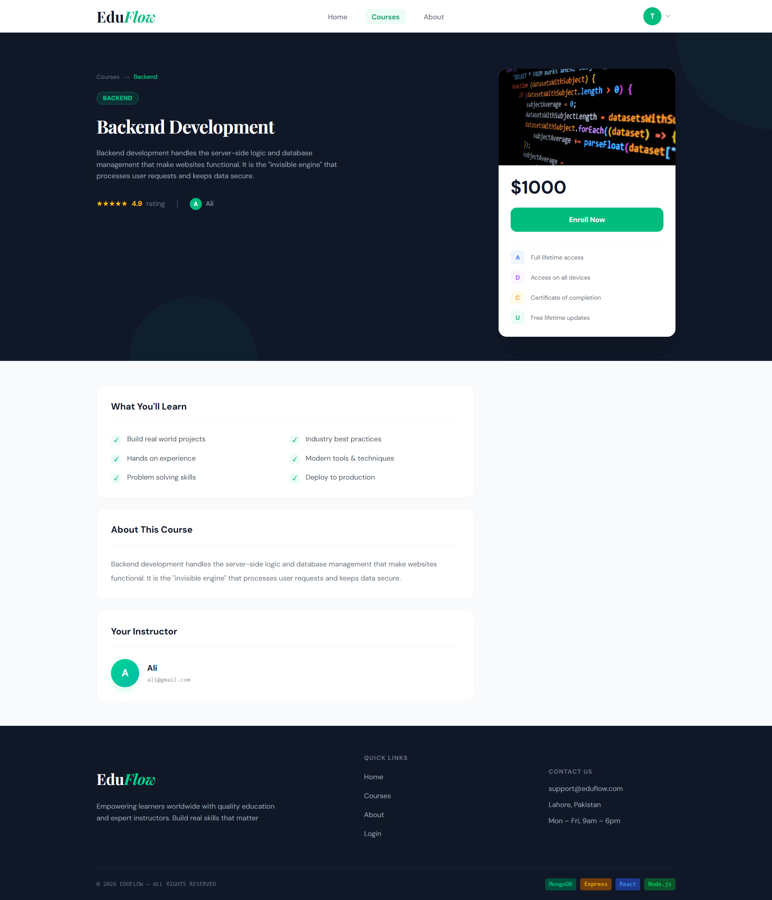
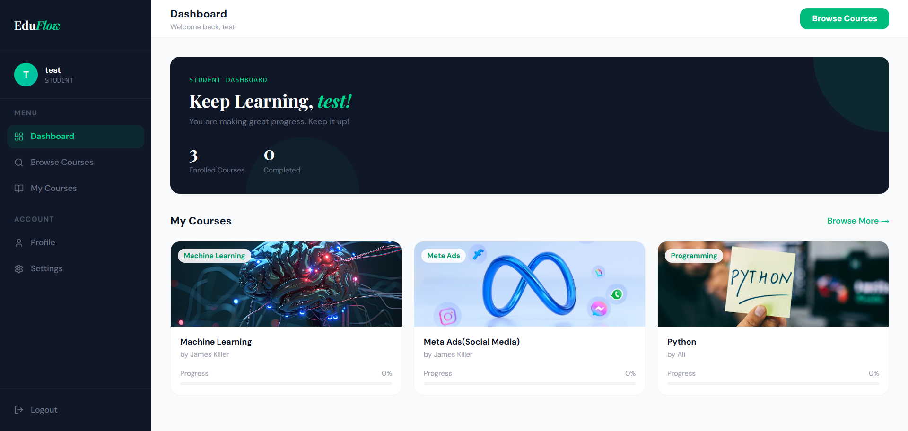
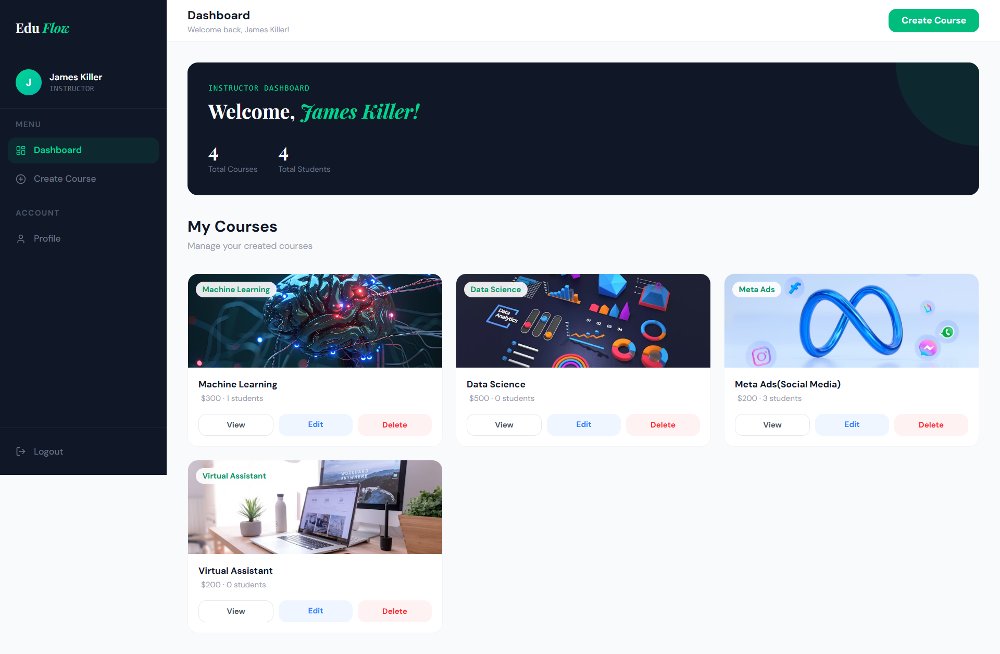
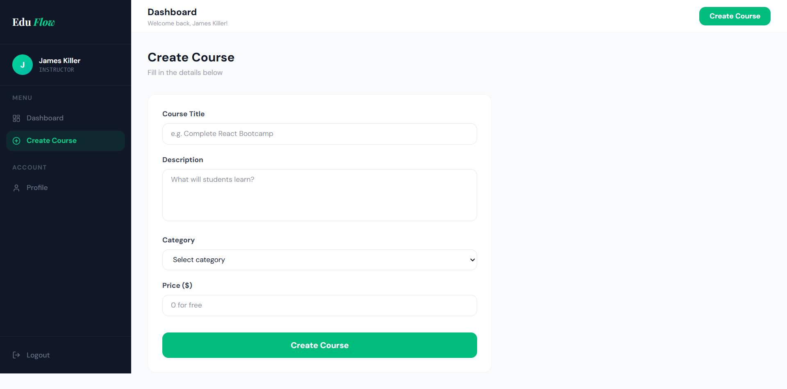
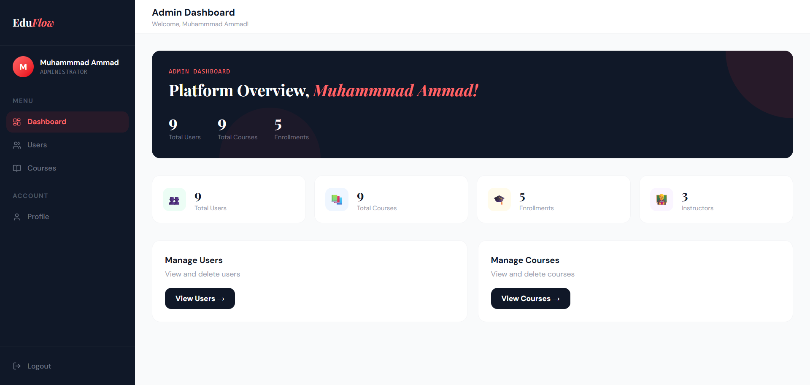
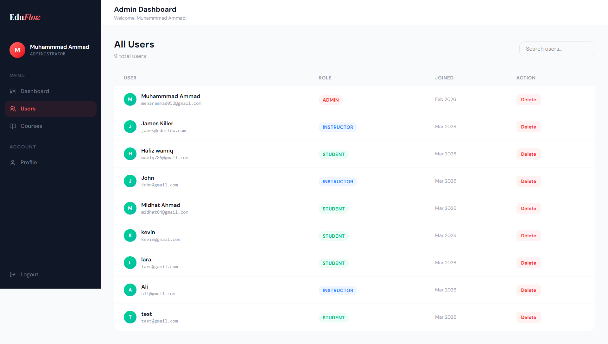
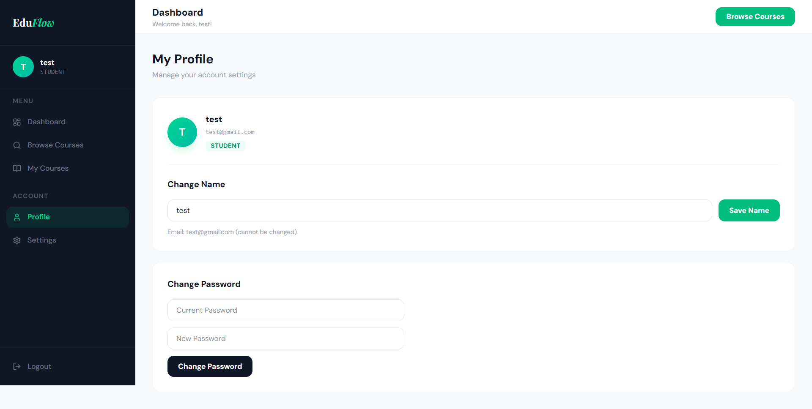

# EduFlow — Full Stack Learning Management System



A full-featured Learning Management System built with the MERN stack. EduFlow supports three user roles — Student, Instructor, and Admin — each with their own dashboard and functionality.

---

## 🚀 Live Demo

[live demo](https://eduflow-project-murex.vercel.app/)

---

## 📌 Table of Contents

- [Project Overview](#project-overview)
- [Features](#features)
- [Technologies Used](#technologies-used)
- [Project Structure](#project-structure)
- [Installation & Setup](#installation--setup)
- [Environment Variables](#environment-variables)
- [API Endpoints](#api-endpoints)
- [Screenshots](#screenshots)
- [Database Models](#database-models)

---

## 📖 Project Overview

EduFlow is a complete Learning Management System where:

- **Students** can browse courses, enroll, and track their learning
- **Instructors** can create, edit, and manage their courses
- **Admins** can manage all users, courses, and view platform analytics

---

## ✨ Features

### Student

- Register & Login
- Browse all courses
- Enroll in courses
- View enrolled courses in dashboard
- Update profile & change password

### Instructor

- Create, edit, delete courses
- View enrolled student count per course
- Manage profile

### Admin

- View platform analytics (total users, courses, enrollments)
- Manage all users (view, delete)
- Manage all courses (view, delete)
- Role-based access control

### General

- JWT Authentication with HTTP-only cookies
- Protected routes based on role
- Fully responsive design (mobile + desktop)
- Toast notifications

---

## 🛠️ Technologies Used

### Frontend

| Technology      | Purpose             |
| --------------- | ------------------- |
| React JS        | UI Framework        |
| React Router v6 | Client-side routing |
| Axios           | HTTP requests       |
| Tailwind CSS    | Styling             |
| React Toastify  | Notifications       |
| Lucide React    | Icons               |

### Backend

| Technology    | Purpose               |
| ------------- | --------------------- |
| Node.js       | Runtime               |
| Express.js    | Web framework         |
| MongoDB       | Database              |
| Mongoose      | ODM                   |
| JWT           | Authentication        |
| Bcrypt        | Password hashing      |
| Cookie Parser | Cookie handling       |
| CORS          | Cross-origin requests |
| Dotenv        | Environment variables |

---

## 📂 Project Structure

```
eduflow/
├── backend/
│   ├── config/
│   │   └── db.js
│   ├── controllers/
│   │   ├── authController.js
│   │   ├── courseController.js
│   │   ├── enrollmentController.js
│   │   ├── userController.js
│   │   └── adminController.js
│   ├── middleware/
│   │   ├── userAuth.js
│   │   └── roleMiddleware.js
│   ├── models/
│   │   ├── userModel.js
│   │   ├── courseModel.js
│   │   └── enrollmentModel.js
│   ├── routes/
│   │   ├── authRoutes.js
│   │   ├── courseRoutes.js
│   │   ├── enrollmentRoutes.js
│   │   ├── userRoutes.js
│   │   └── adminRoutes.js
│   ├── .env
│   └── server.js
│
└── frontend/
    ├── src/
    │   ├── assets/
    │   ├── components/
    │   │   ├── shared/
    │   │   │   └── ProfileSettings.jsx
    │   │   ├── EnrollCourseCard.jsx
    │   │   ├── Navbar.jsx
    │   │   ├── Footer.jsx
    │   │   └── ProtectedRoute.jsx
    │   ├── context/
    │   │   └── AuthContext.jsx
    │   ├── layouts/
    │   │   ├── PublicLayout.jsx
    │   │   ├── StudentLayout.jsx
    │   │   ├── InstructorLayout.jsx
    │   │   └── AdminLayout.jsx
    │   ├── pages/
    │   │   ├── Home.jsx
    │   │   ├── About.jsx
    │   │   ├── Courses.jsx
    │   │   ├── CourseDetail.jsx
    │   │   ├── Auth.jsx
    │   │   ├── student/
    │   │   │   └── StudentDashboard.jsx
    │   │   ├── instructor/
    │   │   │   ├── InstructorDashboard.jsx
    │   │   │   ├── CreateCourse.jsx
    │   │   │   └── EditCourse.jsx
    │   │   └── admin/
    │   │       ├── AdminDashboard.jsx
    │   │       ├── AdminUsers.jsx
    │   │       └── AdminCourses.jsx
    │   ├── services/
    │   │   ├── axios.js
    │   │   ├── authService.js
    │   │   ├── courseServices.js
    │   │   ├── enrollmentService.js
    │   │   ├── userService.js
    │   │   └── adminService.js
    │   └── App.jsx
    └── index.html
```

---

## ⚙️ Installation & Setup

### Prerequisites

- Node.js
- MongoDB
- npm

### 1. Clone the Repository

```bash
git clone https://github.com/yourusername/eduflow.git
cd eduflow
```

### 2. Backend Setup

```bash
cd backend
npm install
```

Create `.env` file (see Environment Variables below), then:

```bash
npm run dev
```

Backend runs on: `http://localhost:4000`

### 3. Frontend Setup

```bash
cd frontend
npm install
npm run dev
```

Frontend runs on: `http://localhost:5173`

---

## 🔐 Environment Variables

Create a `.env` file in the `backend/` folder:

```env
PORT=5000
MONGODB_URI=your_mongodb_connection_string
JWT_SECRET=your_jwt_secret_key
NODE_ENV=development
```

---

## 🔌 API Endpoints

### Authentication

| Method | Endpoint           | Access |
| ------ | ------------------ | ------ |
| POST   | /api/auth/register | Public |
| POST   | /api/auth/login    | Public |
| POST   | /api/auth/logout   | Public |

### Courses

| Method | Endpoint                | Access           |
| ------ | ----------------------- | ---------------- |
| GET    | /api/courses            | Public           |
| GET    | /api/courses/:id        | Public           |
| GET    | /api/courses/my-courses | Instructor       |
| POST   | /api/courses            | Instructor       |
| PUT    | /api/courses/:id        | Instructor       |
| DELETE | /api/courses/:id        | Instructor/Admin |

### Enrollments

| Method | Endpoint                         | Access  |
| ------ | -------------------------------- | ------- |
| POST   | /api/enrollments                 | Student |
| GET    | /api/enrollments/check/:courseId | Student |
| GET    | /api/enrollments/my-courses      | Student |

### User

| Method | Endpoint                  | Access  |
| ------ | ------------------------- | ------- |
| PUT    | /api/user/update-profile  | Private |
| PUT    | /api/user/change-password | Private |

### Admin

| Method | Endpoint             | Access |
| ------ | -------------------- | ------ |
| GET    | /api/admin/analytics | Admin  |
| GET    | /api/admin           | Admin  |
| DELETE | /api/admin/:id       | Admin  |

---

## 📸 Screenshots

### Home Page


### Courses Page



### Course Detail



### Login & Register


### Student Dashboard



### Instructor Dashboard



### Create Course



### Admin Dashboard



### Admin Users



### Profile Page



### Mobile View


---

## 🗄️ Database Models

### User Model

```js
{
  name: String,
  email: String,
  password: String,      // bcrypt hashed
  role: String,          // student | instructor | admin
  timestamps: true
}
```

### Course Model

```js
{
  title: String,
  description: String,
  instructor: ObjectId,  // ref: User
  category: String,
  price: Number,
  timestamps: true
}
```

### Enrollment Model

```js
{
  student: ObjectId,     // ref: User
  course: ObjectId,      // ref: Course
  progress: Number,
  timestamps: true
}
```

---

## 👨‍💻 Developer

**Muhammad Ammad**

- GitHub: [AmmadCode](https://github.com/AmmadCode/Eduflow-Project/)

---

## 📜 License

This project is for educational purposes only.
